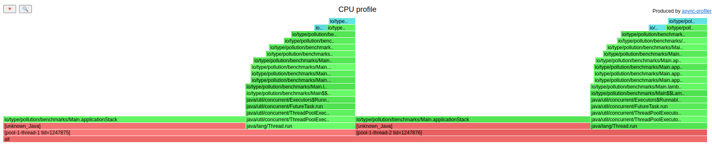
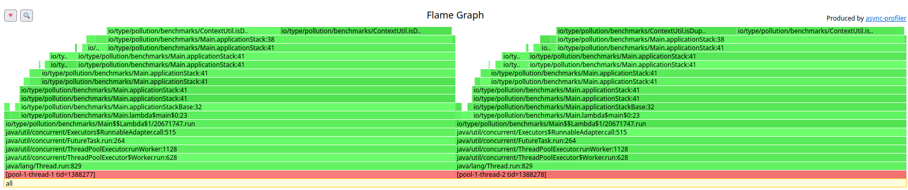

# Troubleshooting JDK-8180450

In the perfect, self-contained and controlled environment of a micro-benchmark 
written with JMH, troubleshooting JDK-8180450 is challenging but still possible, but what 
if it happens in the real world?

## Who says we have *any* perf issue?

*Required*:
- https://github.com/jvm-profiling-tools/async-profiler
- perf-tools
- perf-c2c

Let's run an example (dumb) application that suffer from this issue:

```bash
$ java -XX:+UnlockDiagnosticVMOptions -XX:+DebugNonSafepoints -jar benchmarks/target/type-pollution-benchmarks-0.1-SNAPSHOT.jar 2   
```
and attaching async-profiler to it with:
```bash
$ ./profiler.sh -d 10 -t -f out.html -e cpu <Java pid> 
```
we get

[](https://htmlpreview.github.io/?https://github.com/RedHatPerf/type-pollution-agent/blob/master/benchmarks/images/async/async-profiler.html)

That's not terribly useful, given that the blamed method doesn't match our expectation,
but still give us a good hint that we're CPU limited:
this is clear by counting the number of samples ie 100 Hz * 10 seconds * 2 threads = 2000 samples.

We can dig on this more by using `perf`:
```bash
$ perf stat --timeout 10000 --pid <Java pid>

Performance counter stats for process id '1247858':

         20,013.68 msec task-clock                #    1.999 CPUs utilized          
               616      context-switches          #   30.779 /sec                   
                39      cpu-migrations            #    1.949 /sec                   
                20      page-faults               #    0.999 /sec                   
    82,267,123,004      cycles                    #    4.111 GHz                    
    41,091,980,552      instructions              #    0.50  insn per cycle         
     9,477,353,472      branches                  #  473.544 M/sec                  
           483,549      branch-misses             #    0.01% of all branches        

      10.010738228 seconds time elapsed

```
IPC is 0.5? IPC < 1 it usually means stalls presence. 
A quick check (spoiler; we already know it would report something useful :P)
with [perf c2c](https://man7.org/linux/man-pages/man1/perf-c2c.1.html) it's a no-brain:
```bash
$ timeout 20s perf c2c record -- --delay 10000 java -XX:+UnlockDiagnosticVMOptions -XX:+DebugNonSafepoints -jar benchmarks/target/type-pollution-benchmarks-0.1-SNAPSHOT.jar 2
Events disabled
# ...10 seconds after...
Events enabled
# ...10 seconds after...
[ perf record: Woken up 49 times to write data ]
[ perf record: Captured and wrote 12.552 MB perf.data (148076 samples) ]
```

and to generate the report:
```bash
$ perf c2c report --stats
=================================================
            Trace Event Information              
=================================================
  Total records                     :     148076
  Locked Load/Store Operations      :         18
  Load Operations                   :      70418
  Loads - uncacheable               :          0
  Loads - IO                        :          0
  Loads - Miss                      :          0
  Loads - no mapping                :          4
  Load Fill Buffer Hit              :      70200
  Load L1D hit                      :         71
  Load L2D hit                      :          0
  Load LLC hit                      :        121
  Load Local HITM                   :         19
  Load Remote HITM                  :          0
  Load Remote HIT                   :          0
  Load Local DRAM                   :         22
  Load Remote DRAM                  :          0
  Load MESI State Exclusive         :          0
  Load MESI State Shared            :         22
  Load LLC Misses                   :         22
  Load access blocked by data       :          0
  Load access blocked by address    :          0
  LLC Misses to Local DRAM          :      100.0%
  LLC Misses to Remote DRAM         :        0.0%
  LLC Misses to Remote cache (HIT)  :        0.0%
  LLC Misses to Remote cache (HITM) :        0.0%
  Store Operations                  :      77658
  Store - uncacheable               :          0
  Store - no mapping                :          0
  Store L1D Hit                     :      34054
  Store L1D Miss                    :      43604
  Store No available memory level   :          0
  No Page Map Rejects               :        815
  Unable to parse data source       :          0

=================================================
    Global Shared Cache Line Event Information   
=================================================
  Total Shared Cache Lines          :          4
  Load HITs on shared lines         :      70125
  Fill Buffer Hits on shared lines  :      70106
  L1D hits on shared lines          :          0
  L2D hits on shared lines          :          0
  LLC hits on shared lines          :         19
  Locked Access on shared lines     :          0
  Blocked Access on shared lines    :          0
  Store HITs on shared lines        :      45153
  Store L1D hits on shared lines    :       1556
  Store No available memory level   :          0
  Total Merged records              :      45172

=================================================
                 c2c details                     
=================================================
  Events                            : cpu/mem-loads,ldlat=30/P
                                    : cpu/mem-stores/P
                                    : dummy:HG
  Cachelines sort on                : Total HITMs
  Cacheline data grouping           : offset,iaddr
```
Without digging too much in the output, the suspicious parts are
```bash
=================================================
    Global Shared Cache Line Event Information   
=================================================
  Total Shared Cache Lines          :          4
  Load HITs on shared lines         :      70125
  Fill Buffer Hits on shared lines  :      70106
  L1D hits on shared lines          :          0
  L2D hits on shared lines          :          0
  LLC hits on shared lines          :         19
  Locked Access on shared lines     :          0
  Blocked Access on shared lines    :          0
  Store HITs on shared lines        :      45153
  Store L1D hits on shared lines    :       1556
  Store No available memory level   :          0
  Total Merged records              :      45172
```
presence of shared lines and Store HITs! Who says sharing is a good thing?!

Let's come back to the Java profiling side: we know we have some CPU-bound related problem
and both OS and Java profiler(s) agree on that, but, how to get the best of both worlds
while getting the right level of detail to understand what's going on?

## Down to the Rabbit Hole

Thanks to https://builds.shipilev.net/perfasm/, we have a nice tool we can use to further narrow 
the issue (we need a JVM capable of `PrintAssembly`, see [How to print disassembly from JIT Code?](https://jpbempel.github.io/2012/10/16/how-to-print-disassembly-from-JIT-code.html)
and [PrintAssembly output explained!](https://jpbempel.github.io/2015/12/30/printassembly-output-explained.html)).

This approach emulate what JMH does under the hood with its handy `perfasm` profiler
ie [LinuxPerfAsmProfiler](https://github.com/openjdk/jmh/blob/master/jmh-core/src/main/java/org/openjdk/jmh/profile/LinuxPerfAsmProfiler.java)

Let's run it:
```bash
$ timeout 20s perf record --delay 10000 --event cycles java -XX:+UnlockDiagnosticVMOptions -XX:+PrintAssembly -XX:+PrintNMethods -XX:+PrintNativeNMethods -XX:+PrintSignatureHandlers -XX:+PrintAdapterHandlers -XX:+PrintStubCode -XX:+LogCompilation -XX:LogFile=hotspot.log -XX:+DebugNonSafepoints -jar benchmarks/target/type-pollution-benchmarks-0.1-SNAPSHOT.jar 2
```
And then, process the collected samples (and compilation logs) with:
```bash
$ java -jar benchmarks/tools/perfasm.jar "delay=1000;length=10000000;hotThreshold=0.01" hotspot.log perf.data
```
Which relevant output
```asm
....[Hottest Region 1]..............................................................................
c2, level 4, io.type.pollution.benchmarks.Main::applicationStack, version 104 (101 bytes) 

             0x00007fb54f2d0d97: jne    0x00007fb54f2d0da1
             0x00007fb54f2d0d9d: mov    %rax,0x20(%rsi)
             0x00007fb54f2d0da1: je     0x00007fb54f2d0cd2
             0x00007fb54f2d0da7: mov    $0xffffffde,%esi
             0x00007fb54f2d0dac: mov    %r11,%rbp
             0x00007fb54f2d0daf: callq  0x00007fb547849e00  ; ImmutableOopMap{rbp=Oop }
                                                           ;*checkcast {reexecute=0 rethrow=0 return_oop=0}
                                                           ; - io.type.pollution.benchmarks.ContextUtil::isDuplicatedContext@9 (line 9)
                                                           ; - io.type.pollution.benchmarks.Main::applicationStack@6 (line 38)
                                                           ;   {runtime_call UncommonTrapBlob}
  0.01%      0x00007fb54f2d0db4: movabs $0x800062248,%rax  ;   {metadata(&apos;io/type/pollution/benchmarks/Context&apos;)}
             0x00007fb54f2d0dbe: push   %rax
  0.02%      0x00007fb54f2d0dbf: mov    %rax,%rax
  0.27%      0x00007fb54f2d0dc2: mov    0x28(%rsi),%rdi
 23.61%      0x00007fb54f2d0dc6: mov    (%rdi),%ecx
  1.40%      0x00007fb54f2d0dc8: add    $0x8,%rdi
             0x00007fb54f2d0dcc: test   %rax,%rax
             0x00007fb54f2d0dcf: repnz scas %es:(%rdi),%rax
 10.78%      0x00007fb54f2d0dd2: pop    %rax
  2.76%  ╭   0x00007fb54f2d0dd3: jne    0x00007fb54f2d0ddd
  0.00%  │   0x00007fb54f2d0dd9: mov    %rax,0x20(%rsi)
  0.60%  ↘   0x00007fb54f2d0ddd: je     0x00007fb54f2d0d0f
             0x00007fb54f2d0de3: mov    $0xffffffde,%esi
             0x00007fb54f2d0de8: mov    %r8,%rbp
             0x00007fb54f2d0deb: callq  0x00007fb547849e00  ; ImmutableOopMap{rbp=Oop }
                                                           ;*checkcast {reexecute=0 rethrow=0 return_oop=0}
                                                           ; - io.type.pollution.benchmarks.ContextUtil::isDuplicatedContext@4 (line 8)
                                                           ; - io.type.pollution.benchmarks.Main::applicationStack@6 (line 38)
                                                           ; - io.type.pollution.benchmarks.Main::applicationStack@15 (line 41)
                                                           ;   {runtime_call UncommonTrapBlob}
  0.08%      0x00007fb54f2d0df0: movabs $0x800062448,%rax  ;   {metadata(&apos;io/type/pollution/benchmarks/InternalContext&apos;)}
  0.18%      0x00007fb54f2d0dfa: push   %rax
  0.02%      0x00007fb54f2d0dfb: mov    %rax,%rax
             0x00007fb54f2d0dfe: mov    0x28(%rsi),%rdi
 23.53%      0x00007fb54f2d0e02: mov    (%rdi),%ecx
  1.51%      0x00007fb54f2d0e04: add    $0x8,%rdi
  0.00%      0x00007fb54f2d0e08: test   %rax,%rax
  1.17%      0x00007fb54f2d0e0b: repnz scas %es:(%rdi),%rax
  9.96%      0x00007fb54f2d0e0e: pop    %rax
  2.82%   ╭  0x00007fb54f2d0e0f: jne    0x00007fb54f2d0e19
  0.00%   │  0x00007fb54f2d0e15: mov    %rax,0x20(%rsi)
  0.59%   ↘  0x00007fb54f2d0e19: je     0x00007fb54f2d0d22
             0x00007fb54f2d0e1f: mov    $0xffffffde,%esi
             0x00007fb54f2d0e24: mov    %r8,%rbp
             0x00007fb54f2d0e27: callq  0x00007fb547849e00  ; ImmutableOopMap{rbp=Oop }
                                                           ;*checkcast {reexecute=0 rethrow=0 return_oop=0}
                                                           ; - io.type.pollution.benchmarks.ContextUtil::isDuplicatedContext@9 (line 9)
                                                           ; - io.type.pollution.benchmarks.Main::applicationStack@6 (line 38)
                                                           ; - io.type.pollution.benchmarks.Main::applicationStack@15 (line 41)
                                                           ;   {runtime_call UncommonTrapBlob}
             0x00007fb54f2d0e2c: cmp    $0x67c70,%r10d     ;   {metadata(&apos;io/type/pollution/benchmarks/DuplicatedContext&apos;)}
             0x00007fb54f2d0e33: jne    0x00007fb54f2d0e52  ;*invokeinterface isDuplicated {reexecute=0 rethrow=0 return_oop=0}
....................................................................................................
 79.33%  <total for region 1>
```
And luckly for us, on JDK (11, the one used to run the application), there are not many parts
making uses of `repnz scas` ie [MacroAssembler::check_klass_subtype_slow_path](https://github.com/openjdk/jdk11/blob/37115c8ea4aff13a8148ee2b8832b20888a5d880/src/hotspot/cpu/x86/macroAssembler_x86.cpp#L5514),
responsible to emitting the slow path code for instanceof/checkcast (not only, more on later)
type checks.

## What if...this agent was already implemented?

In a better world, where we can run upfront the agent on cases as suspicious as this one,
what we can get is:
```
$ timeout 10s java -javaagent:agent/target/type-pollution-agent-0.1-SNAPSHOT.jar -jar benchmarks/target/type-pollution-benchmarks-0.1-SNAPSHOT.jar 2
--------------------------
Type Pollution Statistics:
--------------------------
1:      io.type.pollution.benchmarks.DuplicatedContext
Count:  126152118
Types:
        io.type.pollution.benchmarks.InternalContext
        io.type.pollution.benchmarks.Context
Traces:
        io.type.pollution.benchmarks.ContextUtil.isDuplicatedContext(ContextUtil.java:9)
                class: io.type.pollution.benchmarks.InternalContext
                count: 63904149
        io.type.pollution.benchmarks.ContextUtil.isDuplicatedContext(ContextUtil.java:8)
                class: io.type.pollution.benchmarks.Context
                count: 62247969
--------------------------
2:      io.type.pollution.benchmarks.NonDuplicatedContext
Count:  21999
Types:
        io.type.pollution.benchmarks.InternalContext
        io.type.pollution.benchmarks.Context
Traces:
        io.type.pollution.benchmarks.ContextUtil.isDuplicatedContext(ContextUtil.java:9)
                class: io.type.pollution.benchmarks.InternalContext
                count: 11000
        io.type.pollution.benchmarks.ContextUtil.isDuplicatedContext(ContextUtil.java:8)
                class: io.type.pollution.benchmarks.Context
                count: 10999
--------------------------
```
As expected, it correctly reports 2 concrete types performing type checks (secondary super cache invalidations) against the same interfaces,
with `DuplicatedContext` as the main offender, while `NonDuplicatedContext`, instead, doing it way less (count is ~ matching the forced warmup in the code). 
 
## BONUS: Why async-profiler's flamegraph was broken?

To answer this question we've opened [Unknown Java Frame on JDK-8180450 reproducer](https://github.com/jvm-profiling-tools/async-profiler/issues/673)
which important parts are:
- JIT's [sender frame computation](https://github.com/openjdk/jdk/blob/2baf2516e1d172268ec7c4c066a1b53bb0bf0779/src/hotspot/cpu/x86/frame_x86.cpp#L141) assumes `sp` to not change, but the type check logic perform `push/pop` operations on the stack that modify `sp` while running in Java
- Using [perf map agent](https://github.com/jvm-profiling-tools/perf-map-agent) and running the application with `PreserveFramePointer` works, showing correct stack frames, because `perf` just care about the frame pointer

`AsyncGetCallTrace`-based profilers need to perform their own mitigation/stack-recovery mechanism and
sadly, while writing this guide, the current version of async-profiler ([v2.8](https://github.com/jvm-profiling-tools/async-profiler/releases/tag/v2.8)) has disabled most of the mitigations,
to save crashes while trying to recover the right stack-frame: just switching to [v2.7](https://github.com/jvm-profiling-tools/async-profiler/releases/tag/v2.7) will make the profiler able again
to correctly report the guilty method(s).

```bash
$ ./profiler.sh -d 10 -t -f async-profiler.jfr -e cpu <Java pid>
# JFR format store additional info eg BCI, Line Of Code
$ java -cp build/converter.jar jfr2flame --threads --lines async-profiler.jfr async-profiler-lines.html
```
That correctly reports:
[](https://htmlpreview.github.io/?https://github.com/RedHatPerf/type-pollution-agent/blob/master/benchmarks/images/async/async-profiler-lines.html)


